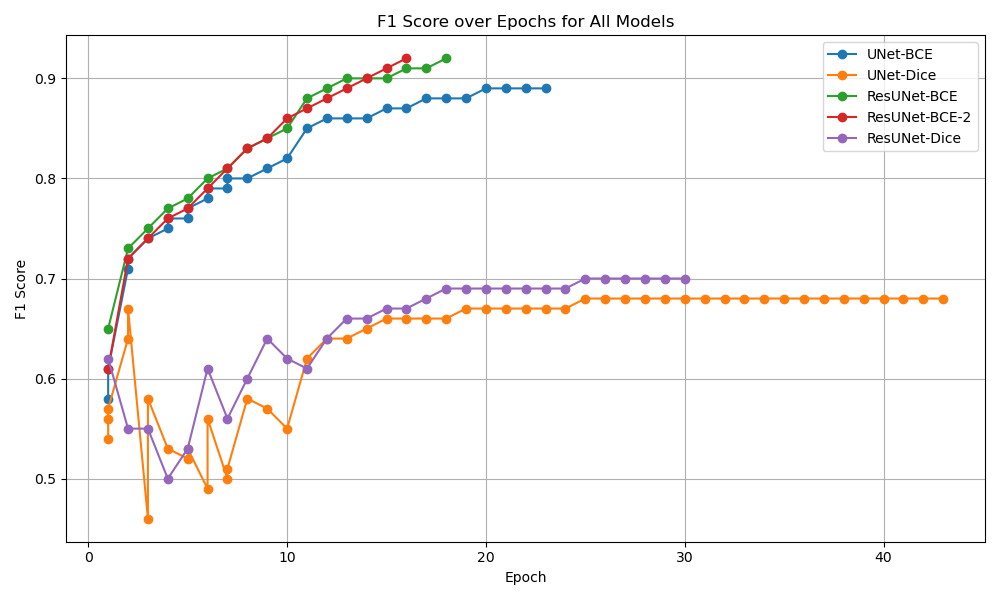

# EC523 Road Segmentation

This repository contains our implementation of ResUNet and Unet for road segmentation using the Massachusetts Roads Dataset for our EC523 final project.
We have used source code from https://github.com/edwinpalegre/EE8204-ResUNet/tree/master?tab=readme-ov-file for baseline resUnet and dataset downloading.
We aim to compare the performance of our custom ResUNet architecture against traditional UNet for binary segmentation of aerial images.

We use the Massachusetts Roads Dataset, https://www.cs.toronto.edu/~vmnih/data/
which consists of:

1108 training images, 49 test images, 14 validation images

## Model Architectures

### 🔹 U-Net
navigate to project_unet_road_segment/
- Two variants:
  - `model_unet.py`: 
  -3 downsampling blocks + bottleneck + 3 upsampling blocks
  -512 filters in bottleneck

  - `model_unet_5.py`: 
  - 5 upsampling blocks	5 downsampling blocks + bottleneck + 5 upsampling blocks
  -1024 filters in bottleneck
  -more Params

### 🔹 ResUNet

- Residual blocks with skip connections to ease training
- Two variants:
  - `model_resunet_ec.py`: 
-Applies BatchNorm + ReLU before convolutions(pre-activation)
- 3-encoder-decoder structure
-uses upSampling2D
-64 → 128 → 256 → 512, 

  - `model_resunet_jn.py`: post-activation (Conv → BN → ReLU)
- Post-activation residual blocks
- Transposed convolutions
- 64 → 128 → 256 → 512 → 1024 → 2048

---
### Results

In the image:
ResUnet-BCE(green) is model_resunet_jn.py trained with BCE loss
ResUnet-BCE-2(red) is model_resunet_ec.py trained with BCE loss
ResUnet-Dice(purple) is model_resunet_jn.py trained with DICE loss
Both Unet results are with model_unet_5.py

### Running the code
git clone https://github.com/your-username/ec523_road_segmentation.git
cd ec523_road_segmentation
conda env create -f environment.yaml --then activate the environment

1) download the dataset using the dataset downloader file from the original codebase
To run ResUnet:
1) edit train_resunet.py in the EE204-ResUNet folder to use either the model in 
- `model_resunet_ec.py`
- `model_resunet_jn.py`
example: model = model_resunet_ec.ResUNet((IMG_SIZE, IMG_SIZE, 3)) **make sure you are using correct model you want to run
2) edit train_fix_jn.py n proj_unet_road_segment folder to use either the model in 
- `model_unet.py`
- `model_unet_5.py`
example: model = model_unet.UNet((IMG_SIZE, IMG_SIZE, 3)) **make sure model is coming from desired file

If you are intrested, debug code, including more complex model variants and extra visulaization during training is lcoated at: EE8204-ResUNet/testing_archs 